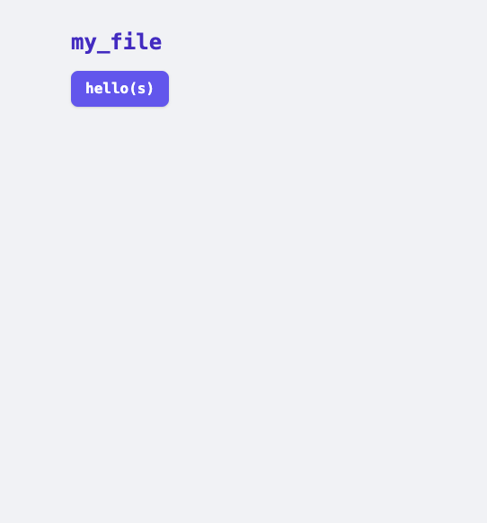
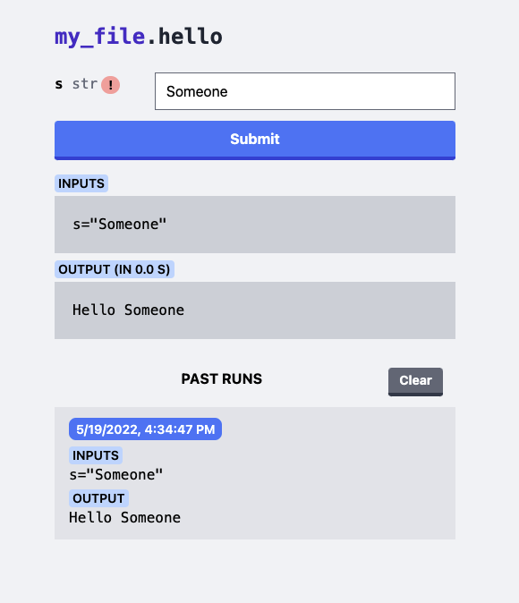
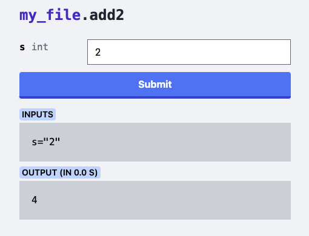
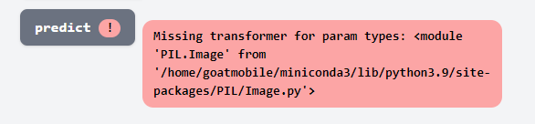
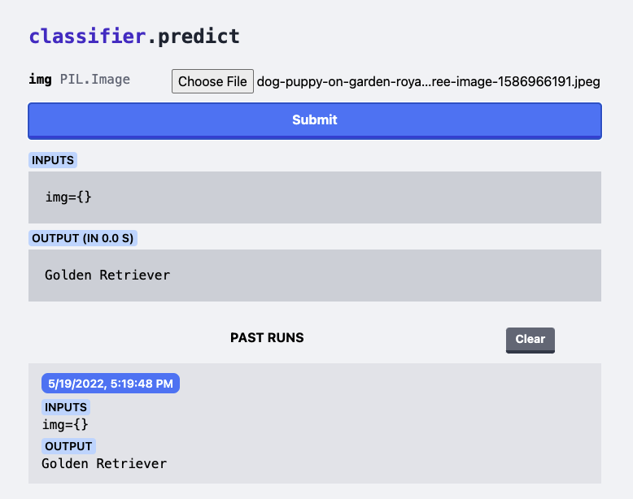

Recently I found myself wanting to run a short shell script from my home server through my phone for some automation tasks. This is certainly possible with existing tools but I figured it'd be nice to make it so any code I could possibly want could be easily wrapped up into a simple web UI. `apylaas` is the result, a Python package to turn existing Python modules into a JSON API controllable through a webpage.

```bash
echo "
def hello(s):
    return f'Hello {s}'
" > my_file.py
pip install apylaas
apylaas --library my_file.py
```

`apylaas` attemps to load `my_file` then indexes the available callable attributes (i.e. mostly functions). It then puts these up on a webserver at `localhost:5000` by default (controllable via the `HOST` and `PORT` environment variables).



Clicking through gives you an interface for the function with a display for the last run as well as (locally) saved previous runs.

.

Above the red exclamation mark reads: "type wasn't annotated, inferring `str`" which is the "safe" default `apylaas` picks when there are no type annotations on functions.

```bash
echo "
def add2(s: int) -> int:
    return s + 2
" >> my_file.py
apylaas --library my_file.py
```

Then at `localhost:5000/add2` the error is gone:



This generally met my needs but it turns out you can do some wonky stuff like reload the Python library every time the web page reloads. Editing some Python and running a test script, you could edit some Python, reload a webpage, and hit submit! And since its based on a JSON API, if you haven't changed the function schema there isn't even a need to reload the page. This behavior is on by default but can be disabled with `--no-reload`.

## Adding Types

`apylaas` is limited in that all types it accepts must be predefined (or `str` is assumed). The interface to register types is open so you could add your own, but Pillow's `PIL.Image` type is supported out of the box, but lets remove it and add it back in as a third-party user. Imagine there is a function like this in `classifier.py`.

```python
def predict(image: PIL.Image) -> str:
    """
    Run 'image' through a classifier model and return a label that describes the image
    """
    ...
```

How does the `Image` get uploaded and marshaled from the web page to Python? The code is relatively simple but cannot use the `apylaas` CLI. First make a script `apylaas_server.py`:

```python
import apylaas
import classifier
from PIL import Image

app = apylaas.App(module=classifier)
app.serve()
```

Running this shows the error on the web UI



This indicates that we need to tell `apylaas` how to handle the `PIL.Image` type. First it needs to know how to accept input for this type in HTML.

```python
# How to render the type in an input element in the HTML
# - You can put arbitrary HTML here, but if it's just a
#   word then 'apylaas' wraps it with an <input> element.
def image_html(type):
    if type == Image:
        return "file"

    return None
```

Next it needs a way to marshal the data from the webpage to Python

```python
# How to take the bytes from the page and turn
# them into a Python type
def image_loader_wrapper(type):
    # Check if the type is something supported
    if type == Image:

        def image_loader(f):
            # Read the file-like f into a PIL.Image
            return Image.open(io.BytesIO(f.read()))

        return image_loader
    return None
```

Using these two when creating an `App` brings it all together.

```python
app = apylaas.App(
    module=classifier,
    input_to_python=[image_loader_wrapper],
    type_to_html=[image_html],
)
app.serve()
```

And there it is! The prediction comes back as a string and is shown on the web UI.



## Serving

If you so choose `app.wsgi_app()` exposes a WSGI compatible object that you can use with your Python serving library of choice rather than the included one (`waitress`).