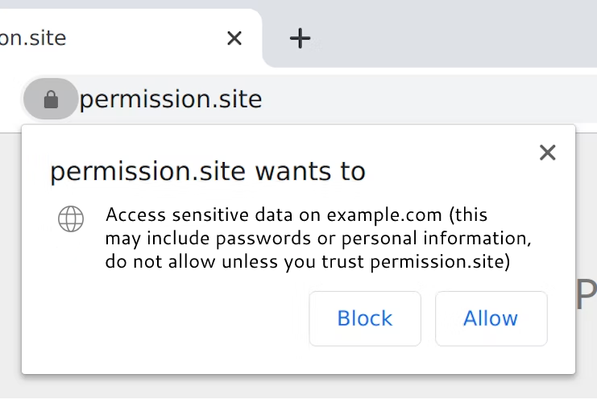

Cross-origin resource sharing ([CORS](https://en.wikipedia.org/wiki/Cross-origin_resource_sharing)) is entirely server controlled today. The server says what the clients can do with the returned data to prevent horrendous security issues via the `Access-Control-Allow-Origin` HTTP header. If a server doesn't want its data used outside of its domains, it's pretty trivial to configure a web server to make it so. This has the downside of preventing whole classes of client applications that use web-hosted data in ways originally unintended by the hosters. Things that can easily exist as standalone applications or mobile apps cannot be ported to websites, which have a far lower barrier to entry and more widespread distribution.

How can CORS be bypassed while maintaining security? It all revolves around the trust between a user and the client website, which right now is presumed to be none across the board. The aptly named Chromium flag `--disable-web-security` disables CORS globally which is not a feasible solution for general web browsing. Clients should be in control of the data returned from servers, not the other way around, but users still should be protected from malicious sites. The mental model of the web today includes strong sandboxing guarantees that are usually trustable given the existence of CORS and things like XSRF prevention. Eroding these to enable more applications is not desirable, as `--disable-web-security` does.

Instead, a per-site permission for CORS would allow users to decide for themselves on a case-by-case basis whether the client site should be allowed to access another domain, even if that domain restricts access to the client domain via the `Access-Control-Allow-Origin` header. The permissions pop up could be sufficiently scary to warn users, something like "XYZ.com wants to: access data on ABC.com, which may include sensitive information. Do not allow this unless you trust XYZ.com." Just like microphone or camera permissions, browsers could store this per-site as a toggleable permission. It may be prudent to also disallow the inclusion of cookies in all CORS-violating requests as an added measure.

There is clearly a demand for this kind of thing. The current enabling technologies are browser extensions (e.g. [Allow CORS](https://chrome.google.com/webstore/detail/allow-cors-access-control/lhobafahddgcelffkeicbaginigeejlf?hl=en) with 600,000+ users) or proxy servers (e.g. [cors-anywhere](https://github.com/Rob--W/cors-anywhere), which has 7k+ GitHub stars and a publicly accessible instance). Both of these have issues, namely the complexity involved. Browser extensions are platform limited and require an install, while servers require servers, which cost money. Security is also an issue with both as a likely-unvetted platform has cleartext access to all the data going through it, meaning any secrets can be swiped and response data can be altered.
