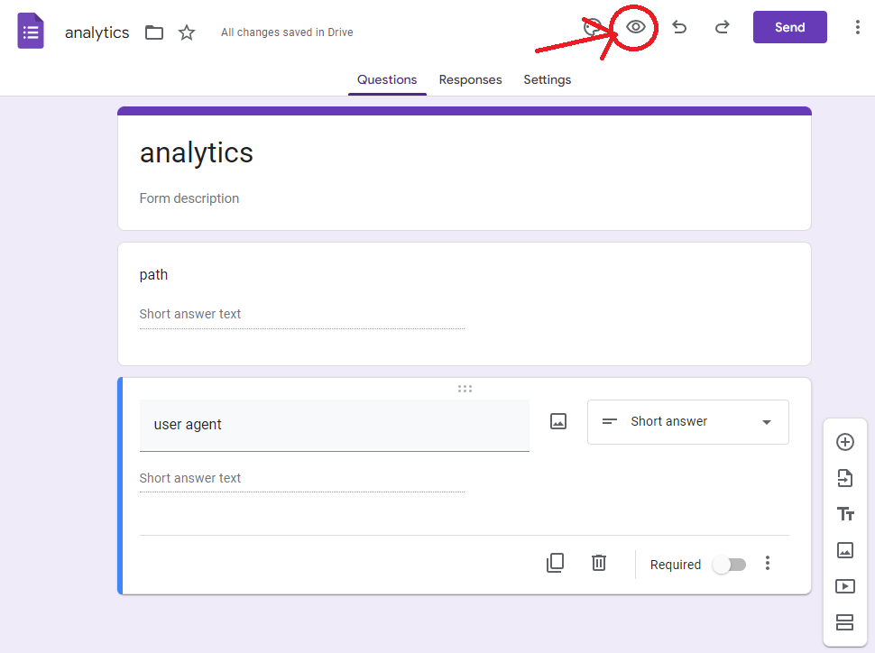
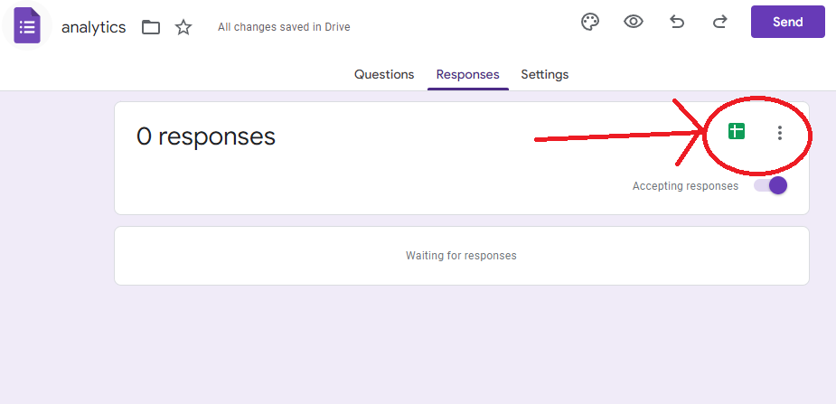

There are dozens of alternatives to Google Analytics out there ([Plausible](https://plausible.io/) for example), but these unfortunately cost money to run and therefore money to use since your data isn't being used to target ads. At the end of the day a basic page-views type analytics service is a key-value database that every page visit adds an entry to, which plenty of free online services let you mimic. [Google Forms](https://forms.google.com) here is a middle ground between the two options: it's free (like Google Analytics) and you don't have to download a JavaScript blob from Google to use it (stay tuned), but the data is still going to Google in the end.

As it turns out Forms lets you submit responses via `POST` requests. Since the response isn't really important, you can send this request from third-party websites via JavaScript by setting `mode: 'no-cors'` on the request. This means you can set up a Google Form with fields for each analytic datapoint you care about, fish these out via JavaScript on each page load, then fire them off to Google Forms for storage and later viewing.

Create a new form and set up the fields you want to extract. For this example it tracks the browser user agent and the current path (e.g. `/blog/posts/forms-analytics` for this webpage).

Next go into the form preview mode with and run this JavaScript snippet in the developer console:




```javascript
document.querySelectorAll("input[name*=entry]").forEach(i => console.log(i.name));
```

This fetches the names of the form fields that the `POST` request made from your website in the order they are defined in the form. Save these for a bit as you'll need them in a minute.

```
entry.1234567
entry.1234568
```

Finally go to the "Responses" tab and make sure to hit the Google Sheets button to enable logging of responses to a spreadsheet, they'll be much easier to view there. Now the form is all set up! This will act as the key-value database (in this case there are a couple values) to store the analytics data for analysis.



On your webpage, add a bit of JavaScript to every page:

```javascript
// Add each entry to the body to send along with the POST request
const body = new FormData();

// The 'path' field
body.append('entry.1234567', window.location.pathname);

// The 'user agent' field
const ua = window.navigator ? window.navigator.userAgent : 'none'
body.append('entry.1234568', ua);

// Get this from the URL when editing your Google Form
const formId = '1FAI-12093-1203j-09sdfDSFLKJkLJ'

// Send the request to Google Forms, the response is inaccessible but we don't need it
const url = `https://docs.google.com/forms/d/e/${formId}/formResponse`
fetch(url, {
  method: 'POST',
  mode: 'no-cors',
  body: body
})
```

Load this on some page then head over to your Google Form responses Sheet to see the results! In all this approach gives you the site owner a measure of control over exactly what data is being exfiltrated to a third-party and who that third-party is (Google Forms is used here but other free forms could easily take its place).

## Caveats

Obviously this is a hacky solution and has a host of issues, namely that anyone can also trivially access the form and submit whatever they want. If this is a problem for you then you're probably better off dropping the $10 a month for an alternative service. JavaScript and access to the Google Forms domain (`docs.google.com`) is also required so certain clients may block the analytics script from running properly.