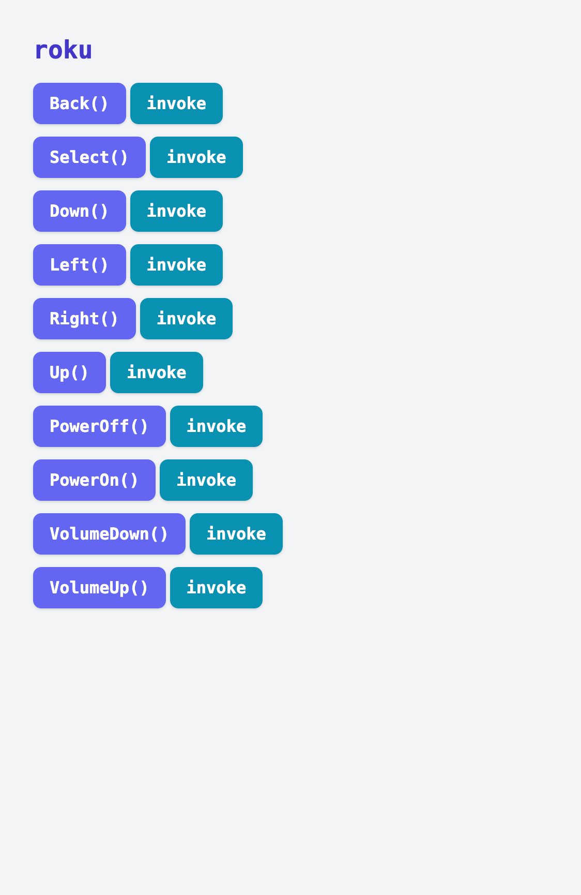

Roku TVs ship with a rather extensive ["External Control Protocol"](https://developer.roku.com/docs/developer-program/dev-tools/external-control-api.md) anyone with a routable connection to the TV do basically anything via HTTP requests. For most, your TV will be on your local network with an IP address of something like `192.168.0.100`. `curl` can show off a basic use of the ECP:

```bash
# turn off the TV
curl -X POST 192.168.0.100:8060/keypress/PowerOff
```

There are plenty of [other keypresses](https://developer.roku.com/docs/developer-program/dev-tools/external-control-api.md#keypress-key-values) that can also be sent. While there are plenty of Roku iOS and Android apps and even a [first party web remote](http://devtools.web.roku.com/RokuRemote/), [`apylaas`](https://github.com/goatmobile/apylaas) makes it easy to implement a custom simple interface that can be hosted on a web server and accessed from anything with a browser. It's not the best or most complete interface, but it's something simple that can be understood end-to-end and also works as a nice demo of `apylaas`.

First, ensure `apylaas` is installed:

```bash
python -m pip install git+https://github.com/goatmobile/apylaas.git
apylaas -h
```

Next we need a Python file that implements the functionality. Here that will be a set of keypresses for common things (e.g. the D-pad, on/off, volume, play/select).

```python
import apylaas
import requests


TV_IP = "192.168.1.152:8060"


def _make_request_method(key):
    """
    Generate a function that presses 'key' on a Roku TV
    """
    def fn():
        requests.post(f"http://{TV_IP}/keypress/{key}")

    fn.__name__ = key
    return fn


keys = [
    ("PowerOn", "power", 0),
    ("PowerOff", "power", 0),
    ("Up", "dpad", 1),
    ("Down", "dpad", 1),
    ("Right", "dpad", 1),
    ("Left", "dpad", 1),
    ("VolumeUp", "vol", 2),
    ("VolumeDown", "vol", 2),
    ("Select", "action", 3),
    ("Back", "action", 3),
]

# For each of the key presses above, create a function for them in the local
# module scope. These will all get scooped by apylaas to generate a web UI
for key, group, priority in keys:
    locals()[key] = apylaas.group(group, group_priority=priority)(
        _make_request_method(key)
    )
```

Then run `apylaas` and tell it about that module.

```bash
apylaas --ignore-hidden --no-reload --library roku.py
```

Visit localhost:5000 and click some buttons to see it run! Functions with no parameters can be called directly from the index page with the "invoke" button.



P.S. I find it nice to wrap it all up in a Dockerfile so it integrates into my local deployment stack.

```Dockerfile
FROM python:3.11.2-alpine3.17

WORKDIR /opt/apylaas
RUN apk add git
RUN python3 -m pip install requests
RUN python3 -m pip install git+https://github.com/goatmobile/apylaas.git
COPY roku.py roku.py

ENTRYPOINT ["apylaas", "--library", "roku.py", "--ignore-hidden", "--no-reload"]
```

then

```bash
docker build . --tag roku:local
```