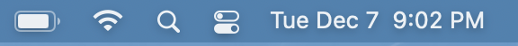
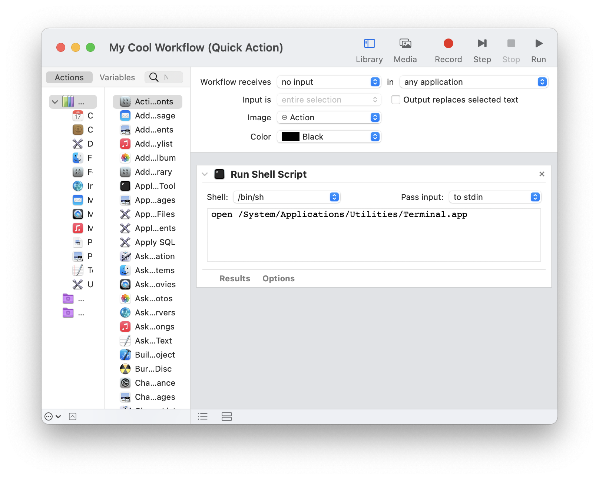
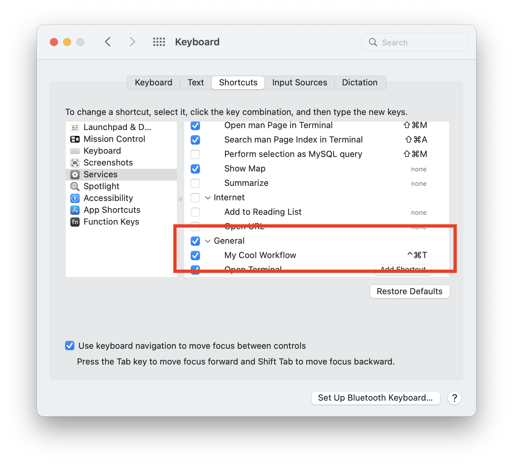
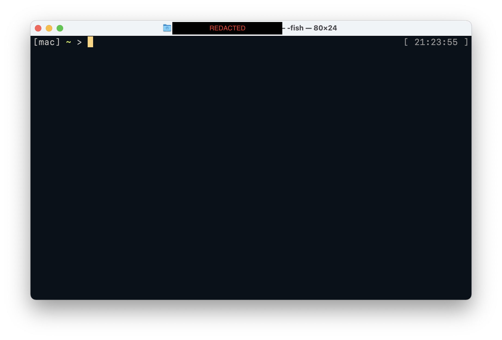
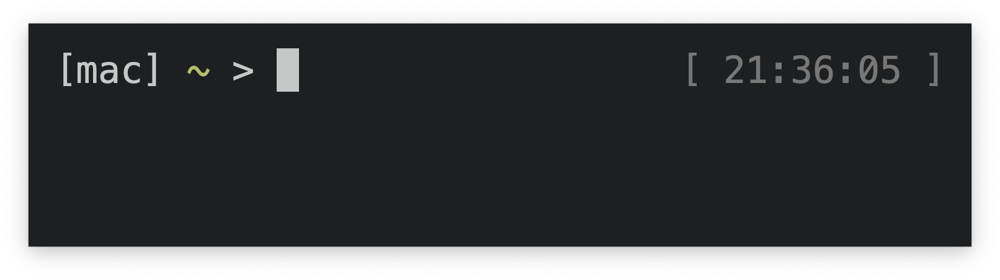
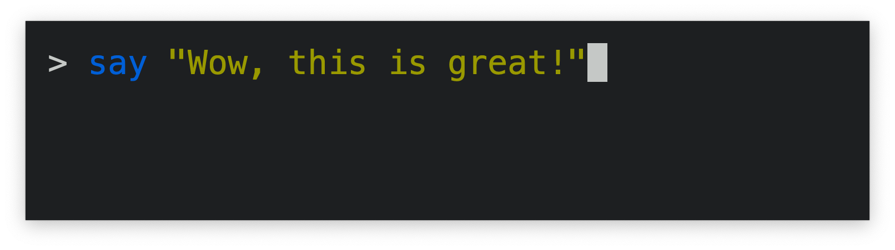

I do my daily driving from MacOS. One of the great things about MacOS is Spotlight. It's like a little secret menu that can do really neat things like open a program or add 2 numbers. Secret because no one who doesn't already know about it is going to find out. Sure you can click the little magnifying glass in the top bar but no one's doing that, all the other icons too much more clickable to bother.



I have a problem with Spotlight though. I don't like typing in Spotlight. I like typing in my terminal where I can `say meow` in between `rm -rf`-ing my way through various system folders. Wouldn't it be great if Spotlight wasn't Spotlight and was actually a terminal?

Of course this already exists in real applications like Alfred or Cerebro, but installing things is lamer than typing into Spotlight. Let's see if we can make this happen and only install a little bit of stuff.

First off clicking is out of the question, so we need the keyboard shortcut. Thankfully a built-in quirk of MacOS will put any Automator "Quick Actions" in the System Preferences keyboard shortcuts pane which work globally (unless captured by some other program first, so make sure to choose something unique). A 1-liner Quick Action in Automator to `open /System/Applications/Utilities/Terminal.app` will do the trick.



Don't forget to press the Run button to see your hard work in action! After a quick trip to System Preferences to set up your shortcut of choice we're in business.



That's great and all but it's just an ordinary terminal. Too much room for too many words! But we'll get to that later. First we have to deal with these startup times, yeesh!



Terminal.app is great. Especially because I've never bothered to use iTerm 2 (no installing things). We'll have to break that rule a little with Alacritty which starts up a teensy bit faster. Changing the Automator script to run `/Applications/Alacritty.app/Contents/MacOS/alacritty` is step 1, then the customizations. There needs to be a small window and no pesky title bars. Easy enough with this `~/.config/alacritty/alacritty.yml`:

```yaml
window:
  dimensions:
   columns: 40
   lines: 4
  padding:
   x: 20
   y: 20
 decorations: none

font:
  size: 30.0
```

Things are starting to look better. We can get rid of most of the characters but we want to keep something so it looks terminal-y. Probably just the `>` is good. The astute reader will also notice this is `fish` so you will have to adjust accordingly.



Detecting the small terminal is a simple matter of `tput`-ing around in `~/.config/fish/config.fish`

```bash
export IS_QUICKTERM=0
if test (tput lines) -lt 7
    export IS_QUICKTERM=1
end
```

Now other places can use `IS_QUICKTERM` to do things differently, like in `~/.config/fish/functions/fish_prompt.fish`:

```bash
# Count how many prompts have been shown
export TERM_PROMPTS=0

function fish_prompt --description 'Write out the prompt'
    if test $IS_QUICKTERM -eq 1
        # Mini terminal prompt!
        if test $TERM_PROMPTS -eq 1
            # Only 1 command is allowed, but give some
            # time to look at the output
            sleep 3
            exit
        end
        # Don't show anything fancy
        printf '> '
        export TERM_PROMPTS=(math $TERM_PROMPTS + 1)
    else
        # The regular one
        printf '[mac] %s%s%s > ' (set_color $fish_color_cwd) (prompt_pwd) (set_color normal)
    end
end
```

and in `~/.config/fish/functions/fish_right_prompt.fish`:

```bash
function fish_right_prompt -d "Write out the right prompt"
    if test $IS_QUICKTERM -ne 1
        # Only show the date on a real sized terminal
        set_color 777
        echo "[" (date '+%T')" ]"
        set_color normal
    end
end
```

There it is! A nice looking box I can pop open at my lesiure to run a quick command, like opening VSCode to a folder with `code` or copying a file to the clipboard with `pbcopy`.



And it only took editing 4 files and clicking on a few dozen things!
